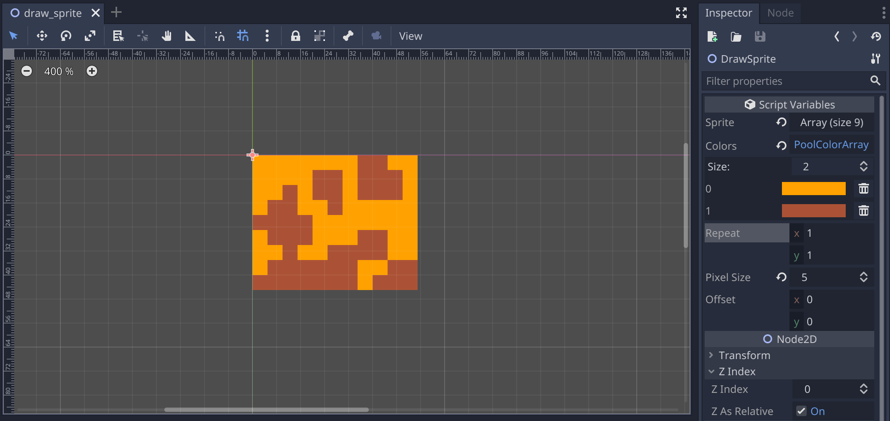

# Godot 3 2D Draw Sprite

  

A script to create \"sprites\" using the `_draw()` function to easily create patterns, change the color palette, or change the pixel size.

> The variables `_sprite` and `_colors` are created using [Aseprite to Godot variables](https://github.com/hiulit/aseprite-to-godot-variables).



## Table of contents

### Variables

- [sprite](#sprite)
- [colors](#colors)
- [repeat](#repeat)
- [pixel_size](#pixel_size)
- [offset](#offset)

## Variables

### sprite

A 2D array with the indices of the [colors](#colors) array.
It can have `null` values (those will be completely transparent pixels).

```gdscript
export(Array, Array, int) var sprite = _sprite setget _set_sprite
```

|Name|Type|Default|Setter|
|:-|:-|:-|:-|
|`sprite`|`Array`|`_sprite`|`_set_sprite`|

**Example**:

```gdscript
var _sprite = [
  [0,0,0,0,0,0,0,1,1,0,0,],
  [0,0,0,0,1,1,0,1,1,1,0,],
  [0,0,1,0,1,1,0,1,1,1,0,],
  [0,1,1,0,0,1,0,0,0,0,0,],
  [1,1,1,1,0,0,0,0,0,0,0,],
  [0,1,1,1,0,0,0,1,1,0,0,],
  [0,0,1,0,0,1,1,1,1,0,0,],
  [0,1,1,1,1,1,1,0,0,1,1,],
  [1,1,1,1,1,1,1,0,1,1,1,],
]
```

### colors

The colors of the sprite.

```gdscript
export(PoolColorArray) var colors = _colors setget _set_colors
```

|Name|Type|Default|Setter|
|:-|:-|:-|:-|
|`colors`|`PoolColorArray`|`_colors`|`_set_colors`|

**Example**:

```gdscript
var _colors = PoolColorArray([
  Color(1.0,0.63,0.0,1.0),
  Color(0.67,0.32,0.21,1.0),
])
```

### repeat

The amount of times each sprite is repeated on the X and Y axis.
Useful to create a pattern.

```gdscript
export(Vector2) var repeat = Vector2.ONE setget _set_repeat
```

|Name|Type|Default|Setter|
|:-|:-|:-|:-|
|`repeat`|`Vector2`|`Vector2.ONE`|`_set_repeat`|

### pixel_size

A multiplier to increase the size of the sprite.

```gdscript
export(int) var pixel_size = 1 setget _set_pixel_size
```

|Name|Type|Default|Setter|
|:-|:-|:-|:-|
|`pixel_size`|`int`|`1`|`_set_pixel_size`|

### offset

The amount of extra pixels of the sprite from its original position.

```gdscript
export(Vector2) var offset = Vector2.ZERO setget _set_offset
```

|Name|Type|Default|Setter|
|:-|:-|:-|:-|
|`offset`|`Vector2`|`Vector2.ZERO`|`_set_offset`|

## 🗒️ Changelog

See [CHANGELOG](/CHANGELOG.md).

## 👤 Author

- hiulit

## 🤝 Contributing

Feel free to:

- [Open an issue](https://github.com/hiulit/Godot-3-2D-Draw-Sprite/issues) if you find a bug.
- [Create a pull request](https://github.com/hiulit/Godot-3-2D-Draw-Sprite/pulls) if you have a new cool feature to add to the project.

## 🙌 Supporting this project

If you find this project helpful, please consider supporting it through any size donations to help make it better.

[](https://www.patreon.com/hiulit)

[](https://ko-fi.com/hiulit)

[](https://www.buymeacoffee.com/hiulit)

[](https://www.paypal.com/paypalme/hiulit)

If you can't, consider sharing it with the world...

[](https://twitter.com/intent/tweet?url=https://github.com/hiulit/Godot-3-2D-Draw-Sprite&text=%22Godot%203%202D%20Draw%20Sprite%22%0AA%20script%20to%20create%20%5C%22sprites%5C%22%20using%20the%20%60_draw()%60%20function%20to%20easily%20create%20patterns,%20change%20the%20color%20palette,%20or%20change%20the%20pixel%20size.%0A%0A%3E%20The%20variables%20%60_sprite%60%20and%20%60_colors%60%20are%20created%20using%20%5BAseprite%20to%20Godot%20variables%5D(https://github.com/hiulit/aseprite-to-godot-variables).%0A%0ABy%20@hiulit%0A%0A)

... or giving it a [star](https://github.com/hiulit/Godot-3-2D-Draw-Sprite/stargazers).

Thank you very much!

## 📝 Licenses

- Source code: [MIT License](/LICENSE).
- Documentation ([GDScriptify](https://github.com/hiulit/gdscriptify)): [MIT License](/LICENSE_GDSCRIPTIFY.txt).

---

Powered by [GDScriptify](https://github.com/hiulit/gdscriptify).
